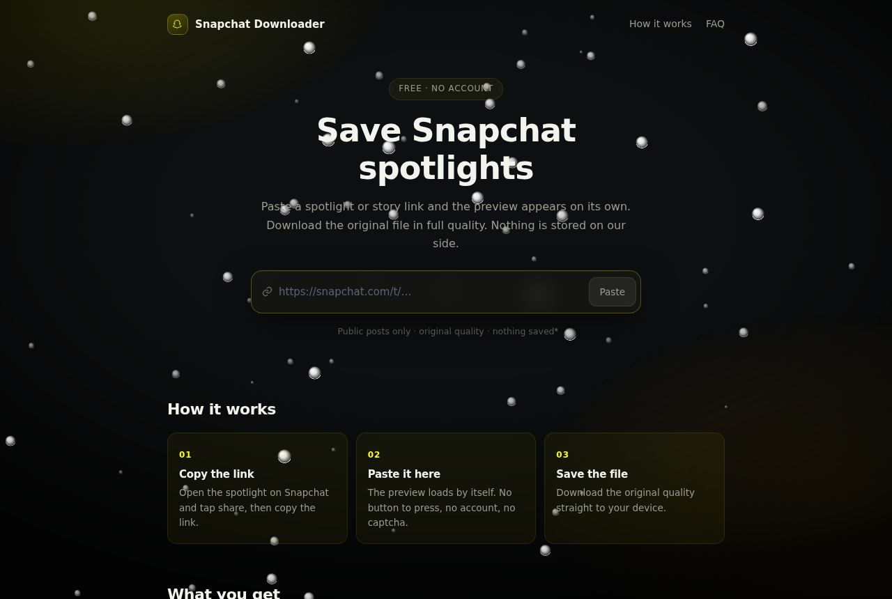

<div align="center">

# 👻 Snapchat Downloader

### Save Snapchat Spotlights and Stories in full quality. No account, no app, nothing stored.




</div>

---

## ✨ Features

| | |
|:--|:--|
| ⚡ | **Auto preview** &nbsp; Paste a link and the video appears on its own, no button to press |
| 🎞️ | **Original quality** &nbsp; The file Snapchat serves, at the size it was published, never recompressed |
| 🔒 | **Nothing stored** &nbsp; Files stream straight through, no queue, no cache, no copy on the server |
| 👤 | **No account** &nbsp; No login, no extension, no app, the same on desktop and phone |
| 🎯 | **Right video every time** &nbsp; The requested snap is pinned by its id, never a recommendation |

## 🧭 How it works

```
🔗 Copy the link  ➜  📥 Paste it here  ➜  💾 Save the file
```

1. 🔗 **Copy the link** &nbsp; Open the spotlight on Snapchat, tap share, copy the link
2. 📥 **Paste it here** &nbsp; The preview loads by itself, no captcha and no sign in
3. 💾 **Save the file** &nbsp; Download the original quality straight to your device


## 🗂️ Project layout

```
snapchat-downloader/
├── 🟢 backend/     Go server, extraction, media proxy, static host
│   └── main.go
└── 🔵 frontend/    React, TypeScript, Vite
    └── src/
        ├── App.tsx
        ├── brand.ts       theme and copy
        ├── components/     splash, snow bubbles
        └── styles.css
```

## 🔌 API

| Method | Endpoint | Purpose |
|:------:|:--|:--|
| `GET` | `/api/health` | Liveness and proxy status |
| `GET` | `/api/extract?url=` | Resolve a link to the video and metadata |
| `GET` | `/api/media?url=` | Inline playback stream for the preview |
| `GET` | `/api/download?url=&filename=` | Download stream with a real filename |

## 🚀 Run it

**Backend**

```bash
cd backend
go run .            # listens on :4446, serves ./public
```

**Frontend**

```bash
cd frontend
npm install
npm run dev         # Vite dev server
npm run build       # production build into dist/
```

### 🔧 Environment

| Variable | Default | Meaning |
|:--|:--|:--|
| `PORT` | `4446` | Port the server listens on |
| `SDL_DIST` | `./public` | Folder of built frontend assets |
| `SDL_PROXY` | none | Optional upstream proxy for outbound fetches |


<div align="center">

Made for saving the snaps you want to keep. 👻💛

📄 MIT License

</div>
